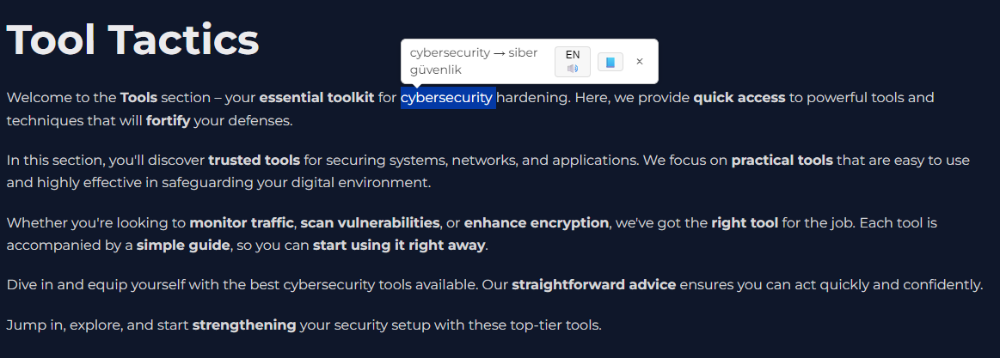
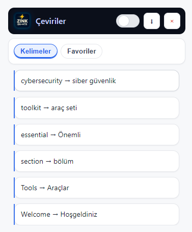
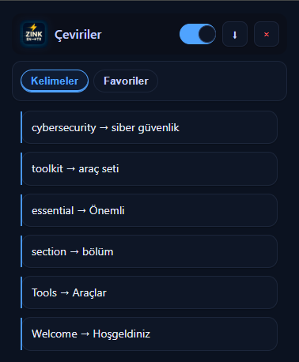

#  ZINK — EN ⇄ TR Çeviri Eklentisi

ZINK, tarayıcı üzerinde **İngilizce ⇄ Türkçe** kelime çevirilerini hızlı ve kolay bir şekilde yapmanı sağlayan modern, şık ve kullanışlı bir Google Chrome eklentisidir.  
Özellikle yabancı kaynaklı dökümanlar, teknik makaleler ve günlük kelime öğrenme sürecinde büyük kolaylık sağlar.  

---

##  Özellikler

 **Anlık Çeviri:** Girilen İngilizce kelimenin Türkçe karşılığını anında gösterir.  
   **Favoriler:** Beğendiğin çevirileri tek tıkla kaydet, istediğin zaman görüntüle.  
   **TXT Olarak Kaydet:** Gün sonunda tüm çevirdiğin kelimeleri `.txt` formatında tek tıkla indirebilirsin.  
   **Modern Arayüz:** Koyu tema (dark mode) ve sade, kullanışlı tasarım.  
   **Telaffuz Desteği:** İngilizce kelimelerin telaffuzunu dinleyebilme özelliği.  

---

## Kurulum

1. **Projeyi indir veya kopyala:**  
   ```bash
   git clone https://github.com/furkansarisin/ZINK.git
   ```
   veya ZIP olarak indirip çıkar.

2. **Chrome’a yükle:**  
   - Chrome tarayıcısını aç  
   - Adres çubuğuna `chrome://extensions/` yaz  
   - Sağ üstten **Geliştirici Modu**nu aktif et  
   - **Paketlenmemiş öğe yükle** butonuna tıkla  
   - İndirdiğin `ZINK` klasörünü seç  

---


## 📷 Ekran Görüntüleri

### Ana Arayüz

### Kelime Çevirisi

### Kelime Çevirisi



